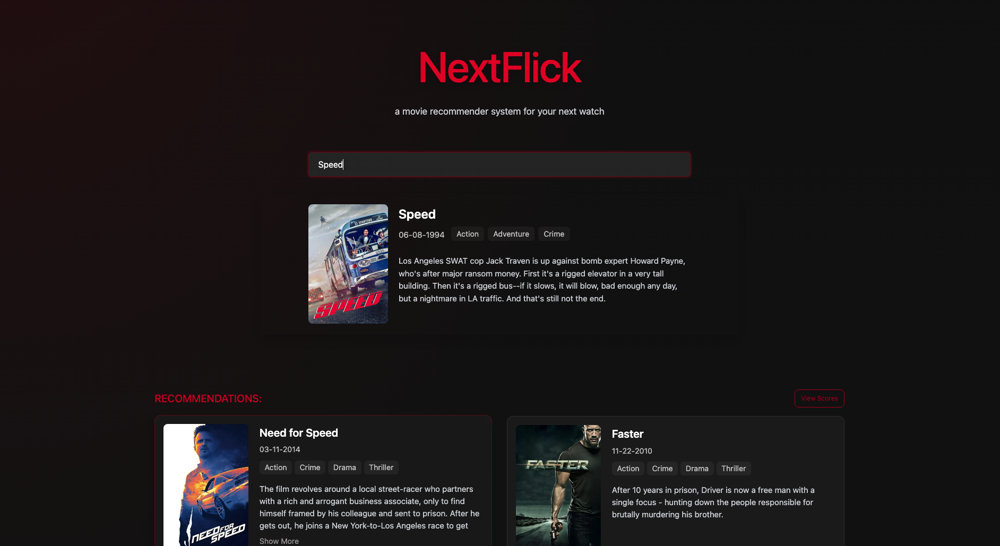

# NextFlick

A content-based movie recommender system that uses semantic embeddings
to help you find your next favorite film.

🔗 [Live NextFlick Site](https://next-flick-phi.vercel.app/) | 
🔗 [API](https://nextflick-lacg.onrender.com)

> ⚠️ **Heads up!** The backend is hosted on Render's free tier, which
> spins down after inactivity. The site may take **1-2 minutes** to load
> recommendations on your first visit. Thanks for your patience!

---

## Screenshots



---

## Features

- 🔍 Search from a library of ~10,000 films
- 🤖 Semantic similarity-based recommendations
- 📊 Similarity scores displayed for each recommendation

---

## Tech Stack

| Layer | Tools |
|---|---|
| Data & ML | Python, Jupyter Notebook, HuggingFace |
| Backend | Python, FastAPI |
| Frontend | React (Vite), CSS |
| Hosting | Vercel (frontend), Render (backend) |

---

## How It Works

### Data Pipeline

- Dataset of ~10,000 movies collected via KaggleHub with fields like
  title, overview, genre, release date, and movie ID
- A `combined_text` field was created from each movie's genre and overview
- Each `combined_text` was encoded into a **384-dimensional vector** using
  the `all-MiniLM-L6-v2` sentence transformer model from HuggingFace

### Recommendations

- Uses **cosine similarity** to compare a selected movie's embedding
  against all others

---

## API Reference

Base URL: `https://nextflick-lacg.onrender.com`

---

## Running Locally

### Prerequisites

- Python 3.9+
- Node.js v18+

### Backend

```bash
git clone https://github.com/username/NextFlick.git
cd NextFlick/backend
pip install -r requirements.txt
uvicorn main:app --reload
```

### Frontend

```bash
cd NextFlick/frontend
npm install
npm run dev
```

### Environment Variables

Create a `.env` file in the backend directory:

```text
TMDB_API_KEY=your_key_here
```

---
